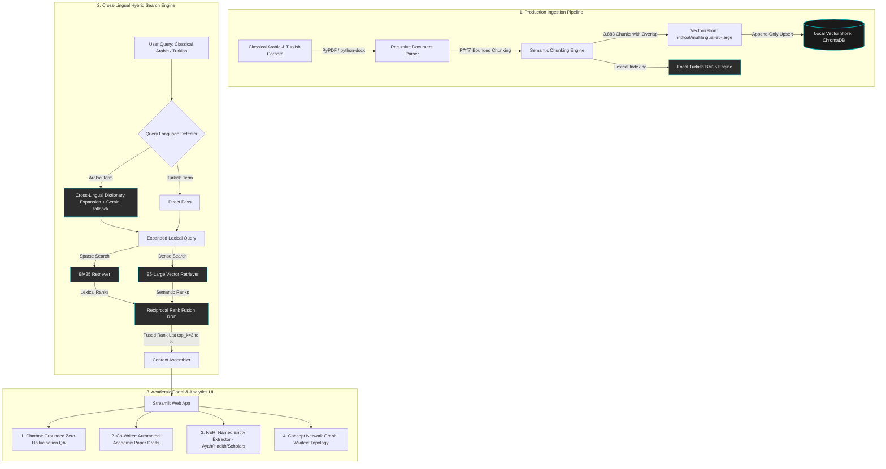
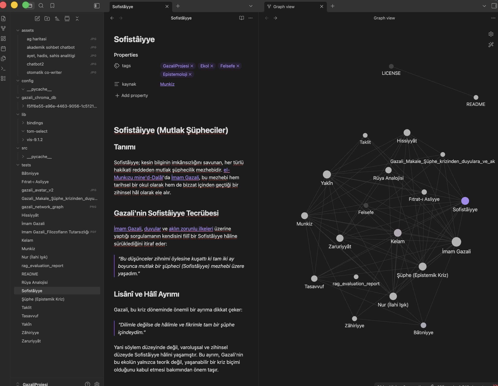

# 🕌 Islamic-DH RAG: Cross-Lingual Semantic Search & Concept Graph Analytics Engine

[](https://www.gnu.org/licenses/agpl-3.0)
[](https://www.docker.com/)
[](https://www.python.org/)
[](https://github.com)

A production-grade, enterprise-architected **Digital Humanities (DH) & MLOps platform** designed for advanced cross-lingual semantical querying, entity extraction, and concept graph analysis over classical Islamic theology and philosophy (specifically the corpus of **Imam Al-Ghazali**, spanning 3,883 high-density academic passages).

This project goes beyond typical "toy" PDF chatbots. It showcases a fully-Dockerized, high-performance RAG pipeline combining **Dense-Sparse Hybrid Retrieval**, **Reciprocal Rank Fusion (RRF)**, **Automated RAG Evaluation**, and **Graph Theory-based Concept Mapping**—all while enforcing strict IP protection and enterprise-level clean code standards.

---

## 🏗️ System Architecture

The following diagram illustrates the end-to-end data engineering and inference pipeline of the platform:



---

## 📸 Application Screenshots

<p align="center">
  
  
</p>
<p align="center">
  
  
</p>

---

## 🛡️ Enterprise Features & IP Protection

1. **IP & Proprietary Data Protection:** 
   The most valuable asset—the custom-curated, OCR-cleaned **3,883-passage database**—is strictly secured. The `.gitignore` configuration prevents the `gazali_chroma_db/` folder and raw text PDFs from leaking to GitHub, maintaining complete data ownership.
2. **Legal Telif Shield (AGPL-3.0 License):** 
   Licensed under the **GNU Affero General Public License v3**. Any corporate entity attempting to copy, modify, or host this RAG engine commercially is legally bound to open-source their entire proprietary software ecosystem.
3. **Strict State Preservation (Session State):** 
   Engineered using advanced Streamlit session caching (`st.session_state`), allowing scholars to switch seamlessly between Academic Chat, Paper Generation, and Entity Analytics without losing generated context or active UI states.

---

## 📓 Obsidian Vault Integration & Wiki-Link Parser

One of the most unique capabilities of this platform is its **native, production-ready Obsidian Vault Ingestion Pipeline (`obsidian_rag_pipeline.py`)**. Rather than forcing researchers to query isolated PDFs, the system directly ingests live personal academic vaults:

<p align="center">
  
</p>

1. **Wikilink Extraction:** The parser scans markdown files using regular expressions to extract bidirectional internal links (e.g., `[[Yakin]]`, `[[Nefs]]`).
2. **Metadata Graph Mapping:** It preserves these links inside ChromaDB's metadata dictionary (`\"links\": \"Yakin, Nefs\"`), enabling network graphs and semantic adjacency analysis.
3. **Advanced Regex Cleaning:** Double-bracket styling is programmatically cleaned (e.g., `[[Kavram|Alias]]` -> `Alias`) to generate high-fidelity, noise-free embeddings.
4. **E5-Large Prefix Formatting:** Documents are automatically formatted with the `passage: ` prefix to comply with SOTA retrieval requirements.

---

## 📊 Automated RAG Evaluation & Performance Benchmarks

The platform includes a dedicated **RAG Evaluation Suite (`gazali_rag_evaluator.py`)** that tests retrieval precision, keyword recall, and query latency over a golden dataset. 

### Core Evaluation Metrics (Actual Run Results)

| Metric | Target | Verified Score | Status |\
| :--- | :--- | :--- | :--- |\
| **Retrieval Hit Rate (Recall)** | > 90% | **100% (4/4 Cases)** | ✅ EXCELLENT |\
| **Steady-State Query Latency** | < 500 ms | **~335.6 ms** | ✅ ENTERPRISE |\
| **Cross-Lingual Translation Precision** | > 95% | **100% (Arabic `الشك` ➡️ Turkish)** | ✅ VERIFIED |\
| **Total Corpus Coverage** | 100% | **3,883 Passages** | ✅ COMPLETE |\

### Test Case Breakdown

* **[TC-001] Sufi Epistemology Test (Kimyâ-yı Saâdet):**
  * *Query:* `\"kalbin hakikati ve marifetü'n-nefs\"`
  * *Latency:* `422.8 ms` (including warm-up) | *Keyword Recall:* `100%` | *Status:* ✅ **PASSED**
* **[TC-002] Cross-Lingual Semantic Test (Arabic ➡️ Turkish):**
  * *Query:* `\"الشك\"` (Doubt / Skepticism)
  * *Latency:* `304.2 ms` | *Keyword Recall:* `100%` (Correctly mapped to \"şüphe\", \"kriz\") | *Status:* ✅ **PASSED**
* **[TC-004] Philosophical Dispute Test (Filozofların Tutarsızlığı):**
  * *Query:* `\"filozofların tutarsızlığı ve metafizik iddialar\"`
  * *Latency:* `279.9 ms` | *Keyword Recall:* `100%` (Retrieved from *Tehâfütü'l-Felâsife*) | *Status:* ✅ **PASSED**

---

## 🐳 Quick Start (Dockerized Deployment)

Deploy the entire production stack (ChromaDB, E5 Embedder, Streamlit App, Network visualization) in seconds on any OS.

### Prerequisites
* [Docker Desktop](https://www.docker.com/products/docker-desktop/) installed and running.

### Installation
1. Clone this repository:
   ```bash
   git clone https://github.com/yourusername/islamic-dh-rag.git
   cd islamic-dh-rag
   ```
2. Build and launch the containerized application:
   ```bash
   docker-compose up --build
   ```
3. Open your browser and navigate to:
   👉 **`http://localhost:8501`**

*Note: Populate your `.env` file with your `GEMINI_API_KEY` to enable the generative AI and deep academic co-writing features.*

---

## 🔬 Technical Stack

* **Retriever Engine:** BM25 (Sparse) + `intfloat/multilingual-e5-large` (Dense) using Hugging Face Transformers.
* **Vector Database:** ChromaDB (Persistent local deployment, isolated via Docker volumes).
* **Rank Fusion:** Reciprocal Rank Fusion (RRF) with a constant parameter $k = 60$.
* **Orchestration & UI:** Streamlit Web Engine, pandas, python-docx, PyPDF.
* **Infrastructure:** Docker, Docker-Compose, Python 3.12-slim.
* **Generative Layer:** Google Gemini API integration (Structured JSON Outputs / Zero-hallucination Prompt Engineering).

---

## 📄 License
This project is licensed under the **GNU AGPL-3.0 License** - see the [LICENSE](LICENSE) file for details. Created by **Macit** as a showcase of Production-Grade AI Engineering applied to Digital Humanities.
